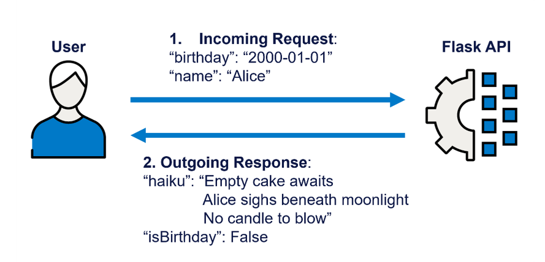

# Birthday Flask App

Welcome to the 11th R&D Session! 🎉 Within the hour, we will explore:

- How to structure a Flask project to separate business and app logic.
- How to add a new route to an existing API.

The goal of this R&D session is to get you comfortable with reading and understanding existing Flask applications, specifically the **Blua Family API**, as well as making modifications to them. This dummy app simulates the structure of the Blua Family API but is much simpler in terms of business logic. Therefore, you can focus on understanding the Flask structure and how to add routes without getting bogged down by complex business logic.

## Prerequisites
I **strongly** recommend you read through the [Flask Fundamentals Cheatsheet](flask_cheatsheet.md) first. It covers the core concepts we'll be using in this session.

The first Flask R&D session is also available. You can find the README and session recording here: [Flask R&D Session 1](https://bupateam.atlassian.net/wiki/spaces/BGUKAI/pages/3687547645/Flask+R+D+Session). This covers a variety of Flask basics. 

## Setup
Firstly, you'll need to clone the repository and install the dependencies. You can do this by running the following commands in your terminal:

1. Clone the repository

```bash
git clone https://BupaCloudServices@dev.azure.com/BupaCloudServices/ainstein_deployments/_git/birthday-flask-app
```

2. Navigate to the project directory

```bash
cd birthday-flask-app
```

3. Create a virtual environment

```bash
conda create --name birthday_venv python=3.11
conda activate birthday_venv
```

4. Install the dependencies

```bash
pip install -r requirements.txt
```

5. Set up environment variables

Create a `.env` file in the root directory of the project and add the following environment variables (during the session, I'll provide the keys)

```
AZURE_OPENAI_ENDPOINT_4O = "your_azure_openai_endpoint"
AZURE_OPENAI_API_KEY = "your_azure_openai_api_key"
```

6. Create a new branch - you can make as many breaking changes as you want without affecting the main branch!

```bash
git checkout -b <your-branch-name>
```

7. Run the Flask app

```bash
python -B app.py
```

Within your terminal, you should see output indicating that the Flask app is running on a local address.

8. To make a request to the running app, open the notebook `notebooks/api_v1_demo.ipynb` and run the cells to see how to interact with the API.

## Why an API
An API lets other systems or users request information from our application and get data back in a predictable format. Our API sits between our data/logic and whoever needs to consume it. Users don't need to be concerned with how content is created, just how to request it. You can think of an API as a contract between the provider (our app) and the consumer (whoever is using our app). The contract specifies how requests should be made and what responses will look like.



## Project Details

As a budding Python developer, you've been asked to review and enhance a simple Flask application that manages birthday greetings. This app is used to send automatic messages to customers based on their birth dates. 

Here's the complete repo structure for your reference:

```
birthday_flask_app/
  ├── app/                             # all app code lives in here
  |   ├── common/                      # shared code across different parts of the app
  |   │   ├── utils/                   # utility functions
  |   │   │   ├── error_handling.py    # handle any app errors and create error responses
  |   │   │   ├── prompt_retrieval.py  # retrieve prompts using names and versions
  |   │   │   └── text_generation.py   # connect and use OpenAI LLMs
  |   │   ├── exceptions.py            # app-specific exceptions
  |   │   └── schemas.py               # pydantic schemas for validation used across the app
  |   |
  |   ├── v1/                          # all v1 code lives in here
  |   │   ├── utils/                   # utility functions
  |   │   │   ├── birthday_haiku.py    # code for creating haikus
  |   │   │   └── route_decorator.py   # wrapper for services, reading requests and sending responses
  |   │   ├── routes.py                # v1 endpoints 
  |   │   ├── schemas.py               # pydantic schemas for validation used by v1
  |   │   └── services.py              # business logic orchestrators
  |   |
  |   └──  __init__.py                 # app factory: creates and configures the Flask app
  |
  ├── data/
  |   └── birthday_prompts.csv         # prompt data for generating birthday messages
  |
  ├── notebooks/                       # notebooks for testing the API
  |   └── api_v1_demo.ipynb            # demo notebook for testing the v1 API
  |
  ├── .env                             # environment variables
  ├── app.py                           # entry point to run the Flask app
  ├── requirements.txt                 # project dependencies
  └── README.md                        # this file
```

As a new developer on the team, your task is to familiarise yourself with the existing codebase and understand its structure. 

Firstly, we observe that the project is organized into several directories, each serving a specific purpose. 
- The `app/` directory contains all the application code, 
- The `data/` directory holds any data files needed by the app, such as prompts for generating birthday messages. 
- The `notebooks/` directory contains Jupyter notebooks for testing and demonstrating the API.

There are two directories within `app/`: `common/` and `v1/`.
- The `common/` directory contains code that is shared across different parts of the app, such as utility functions, custom exceptions, and pydantic schemas for data validation.
- The `v1/` directory contains code specific to version 1 of the API, including utility functions, routes, schemas, and services.

Our app only seems to have one version, but this structure allows for easy expansion in the future if we decide to add more versions.

The `app/` directory contains `__init__.py` file, which serves as the app factory. This file is responsible for creating and configuring the Flask application. It sets up configurations, registers blueprints (which define routes), and initialises any extensions.

From the routes file in `v1`, we can see what endpoints are available in the app. The main endpoint is `/api/v1/birthday-haiku`, which generates a birthday haiku based on the user's name and birth date. This route uses a decorator from the `route_decorator.py` file to handle request validation and response formatting.

If we want to view how a haiku is generated, we can look into the `haiku_service` function in `app/v1/services.py`. The service is the orchestrator function, using utility functions to generate the requested content. We can see the order the utility functions are called. 

To understand the exact Python logic used to generate content, we can explore the service's relevant utils files. In this case, we would look into `birthday_haiku.py` in the `app/v1/utils/` directory.

To ensure that data being sent and received conforms to expected structures, we can check the pydantic schemas defined in `app/v1/schemas.py` and `app/common/schemas.py`. These control the shape of the data, required fields, and types. 

**So when exploring the app, we can follow this path:**
1. Start at the route in `app/v1/routes.py` to see what endpoints are available.
2. For each route, identify the service function it calls in `app/v1/services.py`.
3. Explore the utility functions used by the service in `app/v1/utils/` to understand the business logic.
4. See the schemas used for request and response validation in `app/v1/schemas.py` and `app/common/schemas.py`.

## What are the benefits of this structure?

First and foremost, the project is structured in a way that separates **business logic** from **application logic**. All our business logic is encapsulated within the `services.py` and `utils/` files, while the application logic (Flask routes, request handling, response formatting) is contained within the `routes.py` and `route_decorator.py` files. If we wanted to change how the haiku is created, we would only need to modify the service and utility files without touching the Flask-specific code. 

This structure provides several additional benefits:
- **Modularity**: Each component of the application is separated into its own module, making it easier to test.
- **Scalability**: The versioned structure allows for easy expansion of the API in the future.
- **Maintainability**: Shared code is centralised in the `common/` directory, reducing duplication and making it easier to update shared functionality.
- **Clarity**: The clear separation of routes, services, and utilities makes it easier for developers to navigate the codebase and understand how different parts of the application interact.

## A Deeper Dive: What's Happening Under the Hood?

To fully appreciate the structure, let's look closer at two key files that are fundamental to how this application works: the app factory in `app/__init__.py` and the custom decorator in `app/v1/utils/route_decorator.py`.

### 1. The Application Factory (`app/__init__.py`)
You might have seen simpler Flask examples where the app is created globally in one file, like `app = Flask(__name__)`. We use a more robust pattern called the **Application Factory**.

Instead of creating a Flask app object that's globally visible, we create a function (in our case, `create_app()`) that builds and returns the Flask app instance.

Here's our `create_app()` function:

```python
def create_app():
    """
    Setup Flask app
    1. Load prompt data
    2. Pre request hook
     - Create a request ID
     - Store request ID and api version
    3. Register blueprints
    4. Register error handlers
    """

    app = Flask(__name__)

    # 1. Load prompt data
    # no try except here - if we can't access prompt data, there is a critical issue and the app shouldn't start
    app.prompt_data = access_prompt_data()
    print("PROMPTS: data successfully loaded into app context")

    # 2. Pre-request hook
    @app.before_request
    def setup_request_context():
        # This code runs before every request, after a route has been matched.
        g.request_id = str(uuid.uuid4())
        
        # Determine API version from the blueprint being used for this request
        g.api_version = "unknown"
        if request.blueprint and request.blueprint in app.blueprints:
            blueprint_object = app.blueprints[request.blueprint]
            g.api_version = str(getattr(blueprint_object, 'api_version', g.api_version))

        print(f"ID {g.request_id}: ## New Request to v{g.api_version}. Path: {request.path}")


    # 3. Register blueprints with URL prefixes
    app.register_blueprint(v1_bp, url_prefix='/api/v1')

    # 4. Register error handlers
    register_error_handlers(app)

    return app
```
(`g` is a special object provided by Flask. It's a global namespace for holding data during a single application context, which is essentially the lifetime of one request. We use it to store things like a unique request ID. You'll see it used by the decorator later on.)

Why we do this:
- **No Global State**: It avoids a global app object, which can be problematic. For example, it makes testing much easier because we can create separate app instances with different configurations for each test.
- **Configuration Management**: It allows us to pass in configuration objects, making the app more flexible for different environments (e.g., development, testing, production).
- **Blueprint Registration**: This is where we tell our main app about our routes. Notice the line `app.register_blueprint(v1_blueprint, url_prefix="/api/v1")`. This function imports the `routes.py` file from the v1 directory and registers all of its endpoints under the `/api/v1` prefix. This is how the app becomes aware of the `/birthday-haiku` endpoint.

By using the factory pattern, our entrypoint file `app.py` becomes incredibly simple. All it does is call `create_app()` and run it. The complex setup logic is neatly encapsulated inside the factory.

### 2. The Custom Route Decorator (`app/v1/utils/route_decorator.py`)
When you look at our route in `routes.py`, it seems very clean and straightforward. But there's a lot going on behind the scenes, thanks to our custom decorator `@api_route(...)`.

In `app/v1/routes.py`, you'll see our route looks like this:

```python
@v1_bp.route(f"/birthdayhaiku", methods=["POST"])
@api_route(
    http_request_model=HaikuRequestModel, 
    service_result_model=HaikuServiceResult,
)
def birthday_haiku(validated_input: HaikuRequestModel):
    """
    API Endpoint for generating a birthday haiku.
    """
    return haiku_service(validated_input)
```
The `@api_route(...)` is a custom Python decorator. It's a function that wraps our main route logic (`birthday_haiku`).

We do this to **keep our code DRY (Don't Repeat Yourself)** and separate application logic from business logic.

Imagine we didn't have this decorator. Every single route would need to look something like this:

```python
@v1_blueprint.route("/messy-route", methods=["POST"])
def some_other_route():
    # 1. Get request data
    input_dict = request.get_json(silent=True)     
    
    # 2. Validate input 
    validated_input = HaikuRequestModel(**input_dict)
    
    # 3. Delegate all logic to the service function
    service_result = haiku_service(validated_input)            
    # Enforce the contract: the return value MUST conform to the ServiceResult model
    validated_service_result = HaikuServiceResult.model_validate(service_result)
    
    # 4. Construct the standard success response
    data = validated_service_result.data

    inference_metadata = InferenceMetadata(
        request_id=g.request_id,
        route=request.path,
        api_version=g.api_version,
        status="SUCCESS"
    )

    TypedApiResponse = ApiResponse[type(data)]
    response_body = TypedApiResponse(
        result=data,
        inference_metadata=inference_metadata
    )
    response_body_obj = response_body.model_dump(by_alias=True)

    # 5. Return  
    payload_bytes = json.dumps(response_body_obj).encode('utf-8')
    content_type = 'application/json'
    
    return Response(payload_bytes, status=200, mimetype=content_type)
```

This is a lot of code to duplicate for every route, especially when routes become more complex. The decorator does all of this boilerplate work for us automatically.

When a request comes to `/birthdayhaiku`, the `@api_route` decorator intercepts it and performs the following steps:

1. Parses the incoming JSON from the request body.
2. Validates that JSON against the Pydantic schema you provide (`HaikuRequestModel`). If validation fails, it automatically generates a user-friendly 422 error response.
3. If validation is successful, it calls the original function (`birthday_haiku`) and passes the validated data object (`validated_input: HaikuRequestModel`) as an argument.
4. It waits for the business logic in the service to complete.
5. It takes the return value from the service and validates the return structure using the second Pydantic model you provide (`HaikuServiceResult`).
6. It constructs a standardized JSON response, including metadata like request ID, route, API version, and status.
7. If any error occurs (either during validation or inside the business logic), it catches it and uses our error_handling.py utility to return a standardized JSON error response.

Thanks to this decorator, our route file (`routes.py`) contains functions that only do one thing: call the correct service. And our service file (`services.py`) contains functions that only care about business logic, not about HTTP requests or JSON formatting.

## Next Steps
Now that you understand the structure and key components of the app, your task is to add a new endpoint. **The notebook `notebooks/new_route_worksheet.ipynb` will guide you through the process!**