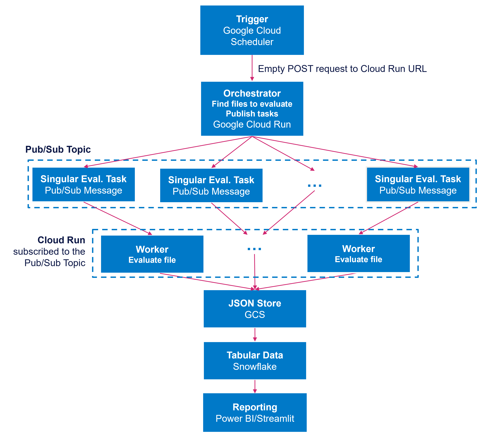

# Purpose
This evaluation strategy focuses on the semantic quality of the content generated by LLMs and consequently, the route responses. We need to create a scalable, automated system to quantify the quality and safety of AI-generated content for the Pre-process, Summarise, and Classify routes, providing a feedback loop for continuous model and prompt improvement. It aims to answers questions like: "Is this summary accurate?", "Is this classification logical?", and "Was all PII correctly redacted?". The quality of the output depends on the model's reasoning and the effectiveness of the prompt.

This strategy does not cover system performance monitoring (i.e., operational metrics like API latency, request failures (5xx errors), token cost, and requests per minute).

# Metrics
The metrics outline the method for quantifying content suitability. Each route will have bespoke metrics chosen for its specific task. As this program is evaluating real, daily outputs, human-annotated ground truth is unavailable for comparison. Therefore, this removes the possibility of using traditional metrics such as accuracy, precision, and recall. 

Instead, we’ll look to use the LLM-as-a-Judge approach, where we use a powerful “evaluator” LLM to assess the output of the “production” LLM. We will create a structured, rubric-based evaluation for each route. The evaluator LLM will be prompted to score the output on a numeric scale (e.g., 1-5) and provide a justification for its score.

| Route | Metric | Description | Methodology | Value |
|-------|--------|-------------|-------------|-------|
| Summarisation | Note Inclusion | How many of the original notes are included (partially and fully)? | (Custom class) Send batches of notes and the summary to an LLM to determine how many are included. | A float in [0, 1] representing the ratio of notes. |
| Summarisation | Note Order Consistency | Are notes included in the correct order? | (Custom class) Select a sample of notes, ask an LLM to determine the order these notes appear in, and calculate Kendall-Tau metric. | A float in [-1, 1] where -1 represents a perfectly imperfect order (reverse order) and vice versa. |
| Summarisation | Coherence | Does the text read well (ideas are ordered and communicated coherently)? | Metric prompt with evaluation instructions and rubric. | An integer in [1, 5] with 5 representing the best score. |
| Summarisation | Fluency | Does the text read well (speaking smoothly and at length without unnatural pauses or repetition)? | Metric prompt with evaluation instructions and rubric. | An integer in [1, 5] with 5 representing the best score. |
| Summarisation | Safety | Does the text contain hate speech, harassment, dangerous content, sexually explicit content. | Metric prompt with evaluation instructions and rubric. | A boolean (0 or 1) representing True or False. |
| Summarisation | Groundedness | Is all information correct? | Metric prompt with evaluation instructions and rubric. | A boolean (0 or 1) representing True or False. |
| Summarisation | Word Limit Compliant | Does the summary adhere to word limit constraints? | Tokenize a summary and count the number of terms. | A boolean (0 or 1) representing True or False. |
| Summarisation | Gender/Name Compliance | Does the summary use the correct name and pronouns? | Instruct a model to analyse the pronouns and names used within the processed text. | A boolean (0 or 1) representing True or False. |
| Classification | Justification Coherence | LLM-as-a-judge | Instruct a model to review the text and class decision, and determine how well the provided justification supports the class. | An integer in [1, 5] with 5 representing the best score. |
| Note Pre-Processing | PII Leakage (False Negatives) | LLM-as-a-judge | Instruct a model to determine whether the input text contains any instances of PII (using the listed definitions from the redaction prompts) | A boolean (0 or 1) representing True or False. |
| Note Pre-Processing | Profanity Leakage (False Negatives) | LLM-as-a-judge | Instruct a model to determine whether the input text contains any instances of profanities | A boolean (0 or 1) representing True or False. |
| Note Pre-Processing | Text Similarity | When no redactions were required, is the output the same as the input? | Compare text similarity for instances when no PII or profanities were detected | A float in [0, 1] representing the similarity of text with 1 signifying the texts are identical. |
| Voided | Justification Coherence | LLM-as-a-judge | Instruct a model to review the text and class decision, and determine how well the provided justification supports the class. | An integer in [1, 5] with 5 representing the best score. |

To increase the performance of the LLM-as-a-Judge metrics, we can create a Golden Dataset. This will contain a small but representative selection of manually-annotated examples (ideally 50-100). These will be used to calibrate the LLM judge's performance and ensure it aligns with human expectations. This dataset isn’t immediately required for the monitoring solution to work, but would support the evaluator with its task.

Evaluation prompts are saved in the prompt dataset. The METRIC binary column can be used to locate them.

# Frequency
The evaluation program needs to be automatically executed daily, evaluating real outputs from the API.  

The code will be structured in a way that would enable ad-hoc evaluation. Reusable assets will be available within the project repo for calculating specific metrics. 

# Data
Currently, requests are saved in JSON files in GCS. They contain the inputted request, the returned response, and all metadata required for evaluation. Therefore, this is the source of data to evaluate. 

This data will only be stored in GCP temporarily before being migrated to Snowflake. Therefore, the daily execution will be using logs from the previous day, ensuring this solution isn’t impacted by the retention policy. 

Given the large quantity of requests, not all data points will be evaluated. Instead, a sample will be selected for each route. This will be a statistically significant number of successful requests (i.e. a evaluation completed on this sample will be representative of the population). This could be a fixed percentage (e.g. 5%) or a flat number of requests (e.g., 100). This makes cost and duration of the evaluation predictable. 

## Sampling Strategies
Sample strategies can be customised per route. For example, if it’s more important that we ensure PII isn’t missed, we can select a larger number of samples from successful note pre-processing requests than from summarise requests. 

The outcome of requests are expected to be imbalanced. We expect to return more False than True results with the incident classifier. We don’t expect to be redacting profanities often. However, we need to understand how our models are working in all scenarios. Therefore, it would be beneficial to sample results based on outcome. 

Reading every JSON file to select samples would be too slow and and computationally expensive. Therefore, we’d need to slightly modify the logging functionality in the app to allow for stratified sampling. Two options have been identified:

### Option 1
The file paths are updated to include the information that will be used to partition files. This solution requires little changes to the existing app code (an additional variable in RequestLogger with path information).

| Route | Strategy | Structure |
|-------|----------|-----------|
| Note Pre-Processing | Partition log files by whether any redactions occurred, any profanities were identified, and any PII was identified. Use a tiered priority strategy for each group: 100% of rare events (profanity redactions); Fixed number/percentage of common events (PII redactions and no redactions) | `year={year}/month={month}/day={day}/route=notepreprocessing/redacted={boolean}/profane={boolean}/pii={boolean}/{request_id}.json` |
| Classify | What was the outcome of the classification? Sample all True classifications and a fixed number/percentage of False classifications. | `year={year}/month={month}/day={day}/route=classify/incident={boolean}/{request_id}.json` |
| Summarise | How many notes were available for summarisation. To reduce cardinality (number of folders), group number of notes into buckets. For example: 1-5 notes => small; 6-20 notes => medium; 21-50 notes => large; 51+ notes => extra large. (We would analyse the distribution before confirming these numbers.) Select a fixed amount from each bucket. | `year={year}/month={month}/day={day}/route=summarise/note_count_bucket={enum}/{request_id}.json` |
| Voided | What was the voided decision (correct, incorrect, no name, or inconclusive)? Sample all “incorrect” and “inconclusive” results (the rarest outcomes) and a fixed number/percentage from “correct” and “no name”. | `year={year}/month={month}/day={day}/route=voided/voided={enum}/{request_id}.json` |

### Option 2
We create a metadata table in BigQuery. After every request, not only does the app produce a JSON file, but it also writes to the metadata table with information that would be used to partition log data. The evaluation solution reads this table instead of the JSON filenames to select which files to evaluate. This will allow us to create more custom partitions (e.g., when the classify route classifies more than just incidents), but will be more expensive. 

## Inputs and Outputs
To evaluate a single datapoint, we require:

- The original input to the API route
- The generated content from the LLM
- The response `inferenceMetadata` (including model choice and prompt versions). 

The program will produce a structured JSON object for each evaluation and store it in GCS, ready to be ingested into Snowflake. This creates a new dataset of evaluation results that doesn’t suffer from a read/write bottleneck that comes with having one file as the source. Hive partitioning can be introduced to separate evaluation runs (i.e., date and route like the logs). 

```json
{
    "evaluation_id": "uuid_for_this_evaluation",
    "original_request_id": "the_g.request_id_from_the_log",
    "api_version": "v0.3",
    "route": "/summarise",
    "evaluation_timestamp": "iso_8601_timestamp",
    "evaluation_model": "gemini-2.5-pro-latest", // The "judge" model
    "production_model": "gemini-2.5-flash", // The model being evaluated
    "tokens": { // tokens used by evaluator
        "candidates_token_count": 70.0,
        "prompt_token_count": 794.0,
        "thoughts_token_count": 410.0,
        "total_token_count": 1274.0
    },
    "metrics": {
        "note_inclusion": {
            "score": 0.910564,
            "justification": "{ // json.dumps(...)
                "n_notes": 50,
                "n_included": 45
                "included_score": 0.905337,
                "n_partial_included": 1,
                "partial_included_score": 0.910564,
                "not_included": ["..."]
            }",
            "prompt_version": 2
        },
        "coherence": {
            "score": 4,
            "justification": "Summary reads quite well.",
            "prompt_version": 1
        },
        "groundedness": {
            "score": 5,
            "justification": "No made up information.",
            "prompt_version": 1
        },
        "word_limit_compliance": {
            "score": 1,
            "justification": "Summary contains 143 words; limit is 250 words.",
            "prompt_version": None
        }
    }
}
```

The program will receive a request to evaluate a day of requests and will therefore operate on a batch of inputs. A single worker will be responsible for processing a singular input. 

# Workflow
A decoupled, event-driven architecture is a robust scalable solution for handling a varying number of evaluation requests.



1. Trigger (Scheduler):

Use Google Cloud Scheduler to trigger a job once a day (e.g., at 2:00 AM).

2. Orchestration (Cloud Function/Run):

The scheduler's target should be a Google Cloud Function or a Cloud Run service. This is the main evaluation orchestrator. The scheduler sends an empty HTTP POST request to the predefined trigger URL of the Orchestrator Cloud Function/Run. The incoming HTTP request causes a new instance of the orchestrator function to spin up and execute its code (main.py)

3. Execution Steps within the Orchestrator:

Firstly, the function connects to the GCS logging bucket. It lists the objects from the previous day and performs the sampling strategy defined in the "Data" section.

For each sampled log file, the orchestrator publishes a message to a Google Pub/Sub topic (e.g., evaluation-tasks). The message body is the GCS path to the log file to be evaluated.

4. Execution Steps within a Worker

A separate Cloud Function is subscribed to the evaluation-tasks Pub/Sub topic. This is the evaluation worker. This enables us to have multiple instances running in parallel, making this highly scalable. Several workers can be evaluating inputs concurrently.

When this worker function receives a message, it:

Reads the logged request/response JSON from the GCS path.

Identifies the route (summarise, classify, etc.).

Reuses existing code, importing prompt_retrieval.py to get the correct evaluation prompt and text_generation.py to call the evaluator LLM.

Calls the evaluator LLM along with the evaluation prompt and data from the log file.

Parses the structured JSON response from the evaluator LLM.

Constructs the final evaluation output JSON (from the "Outputs" section).

Saves this result to a new destination in GCS.

5. Storage (Snowflake):

With all outputs in a common format, these can be migrated into a tabular format in Snowflake, to be read by a front-end reporting tool. 

This workflow is robust, scalable, and keeps evaluation workloads completely separate from the user-facing API.

## Benefits of Separating Orchestrator and Workers
- **Scalability:** If we decide to increase the sample size from 100 to 1,000, we don't change the worker at all. The orchestrator simply pushes 1,000 messages to the topic, and Google Cloud will automatically scale up the number of worker instances to handle the load in parallel.
- **Resilience:** If the evaluation of one log file fails in a worker (e.g., the LLM call times out), that one failure doesn't crash the entire batch. The Pub/Sub system will be configured to send it to a "dead-letter queue" for later inspection, while the remaining evaluations proceed successfully.
- **Decoupling:** The orchestrator doesn't need to know or care how the evaluation is done. The worker doesn't need to know or care how the sampling is done. We can update the worker's logic (e.g., change the evaluation prompt) without ever touching the orchestrator.

## Code Integration
Code will remain within the existing repo to reuse previously tested code. However, it will be segregated from the operational API code. This allows us to:

- Separate code responsibilities 
- Remove any Flask dependencies from the evaluation code.
- Scale API and evaluation code independently of one another.

Here is the recommended repo structure:

```plaintext
├── app/
│   ├── v1/
│   ├── common/
│   └── __init__.py
|
├── evaluation/                 # <-- NEW TOP-LEVEL DIRECTORY
│   ├── orchestrator/           # Code for the Cloud Function that samples and dispatches tasks
│   │   ├── main.py             # Entry point for the Cloud Function
│   │   └── requirements.txt    # Dependencies for the orchestrator (e.g., google-cloud-storage)
│   │
│   └── worker/                 # Code for the Cloud Function that evaluates a single log
│       ├── main.py             # Entry point for the worker, triggered by Pub/Sub
│       ├── requirements.txt    # Dependencies for the worker (e.g., google-cloud-bigquery)
│       └── logic/              # Core evaluation logic, mirroring your 'utils' pattern
│           ├── base_evaluator.py      # An abstract base class for different evaluators
│           ├── summarise_evaluator.py # Implements evaluation for the 'summarise' route
│           ├── classify_evaluator.py  # Implements evaluation for the 'classify' route
│           └── preprocess_evaluator.py# Implements evaluation for the 'pre-process' route
|
├── tests/
├── notebooks/
├── .env.public
├── config.py
├── requirements.txt            # Main API requirements
├── variables.py
├── run.py
└── wsgi.py
```

# Usage
A frontend reporting tool can be designed to display and aggregate scores over time. This will allow us to visualise if performance is changing over time, if the performance is satisfactory for each route, and which inputs lead to lower quality outputs. This could be achieved using Power BI or Streamlit. 

- **Quality Score Over Time:** A time-series line chart showing average scores per route (Summarise, Classify, etc.) on a daily basis.
- **Score Distribution:** A histogram for each route showing the distribution of scores (how many 1s, 2s, 3s, 4s, 5s). This outlines if the model is consistently good or highly variable.
- **PII Leakage Monitor:** A big, red KPI card showing the total count of PII Leakage events over the last 24 hours. This should be 0.
- **Worst-Performers Table:** A table that shows the evaluations with the lowest scores. It should include the original note, the generated output, the score, and the evaluator LLM's justification. This is invaluable for debugging prompts and understanding failure modes. If using a tool like Streamlit, we can include a “Send to Human Review” button to create a direct feedback channel for difficult cases.
- **Route Output Stats:** We can analyse the distribution of output statistics to see how outputs change over time:
    - **Summarise:** Number of notes in one request; summary length.
    - **Classify:** Proportion of true classifications.
    - **Note Pre-Processing:** Proportion of notes being redacted.
    - **Voided:** Distribution of classifications. 

# Critical Disadvantages & Risks
- **Cost and Latency:** The use of LLMs to judge model outputs is significantly more expensive that traditional metrics. However, without having the true label, traditional metrics are not applicable. 
- **The "Blind Leading the Blind" Problem:** LLMs from the same family or provider often share the same underlying biases and blind spots. If the production model makes a subtle mistake , the evaluator model is very likely to make the exact same mistake and agree with the incorrect output. This creates a false sense of security.
- **Prompt Complexity:** Each metric will have a complex prompt to be managed and versioned. The evaluator prompt needs to be extremely robust and clearly instruct the model to be a neutral arbiter, relying only on the provided rules.
- **It's Still Not Ground Truth:** The evaluator’s output is an opinion, not a fact. While it's a much stronger signal of quality than a simple script, it can still be wrong. We cannot treat is_consistent: true as a 100% guarantee of correctness.

# Mitigations
1. Perform the evaluation on a sample of datapoints, not on all requests. 
2. For the evaluator models, use LLMs from an entirely separate provider to reduce the risk of biases.
3. Ask a selection of domain experts (humans) to manually evaluate a subset of data. Run the evaluators on the same subset and compare results. Do the evaluators agree with the humans.