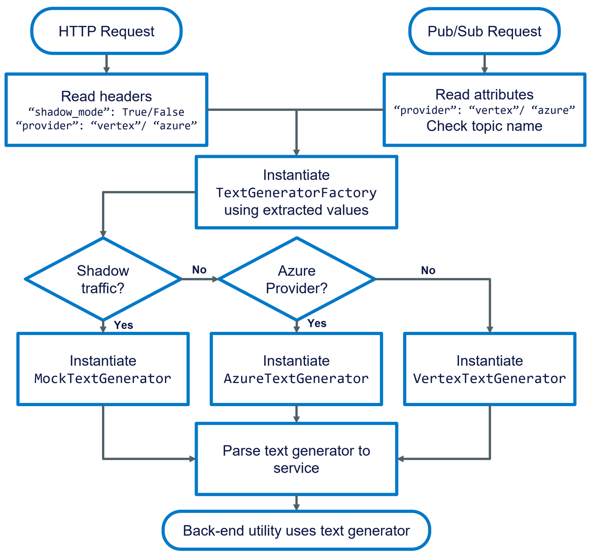

# Text Gen Factory: Load Testing Strategy

The Blua Family app aims to have 50% of residents onboarded by the end of the year. Therefore, it’s vital that we test the apps current ability to handle requests for this amount of users. Sapient will be creating and sending mock requests to our API endpoints. This could be an unnecessarily expensive exercise if we continue to use LLMs for the fake requests. Therefore, we need to consider how to toggle LLM usage within app, blocking calls for fake requests.

## Pub/Sub Application: Dedicated Topic
While the application logic can handle a header/attribute flag, separating traffic at the infrastructure level by creating a dedicated Pub/Sub topic provides significant operational, safety, and monitoring benefits:

**Operational Safety and Isolation**

Creates a complete separation ("air gap") between production and shadow traffic at the infrastructure level.

This eliminates the risk of a misconfigured publishing client accidentally triggering expensive, real LLM calls during a load test or polluting production metrics.

**Independent Monitoring and Alerting**

Enables distinct observability for real vs. shadow traffic within Google Cloud Monitoring.

Allows for separate dashboards and alerting rules for key metrics like message throughput, latency, and unacknowledged message counts (unacked_message_count). An alert on the real-traffic topic is a critical incident; an alert on the shadow topic is non-urgent, preventing alert fatigue for the on-call team.

**Independent Configuration and Scalability**

Each topic and its corresponding subscription can have its own lifecycle and performance configuration.

This includes separate settings for message retention periods, dead-letter policies, and push subscription configurations (e.g., acknowledgement deadlines).

## Proposed Code Change
Code described in this document is pseudo code. It tries to reflect the existing state of the code base, but isn’t guaranteed to work. To save the word count, less significant but functionally vital parts of the code have been left out. To see the final refactor, read the code in the repo! 

The new changes would use a factory pattern to create the appropriate Text Generation instance with every request/task:



### 1. New `TextGeneration` Interface
We currently have a common util that contains the logic for using LLMs. We want to create an additional mock class that will return static responses. We can also create an `AzureTextGenerator` class, allowing us to run the app in the Sandbox environment.

```python
# NEW FILE: app/common/clients/text_generation.py
class TextGenerator(ABC):
  """
  Defines the interface, to be used by the services/utils
  """
  @abstractmethod
  def generate_text(
    self,
    contents: str,
    system_instruction: str = None,
    response_schema: dict = None,
    task_str: str = None
  ) -> dict:
    raise NotImplementedError
    
# UPDATE FILE: app/common/text_generation.py --> app/common/clients/vertex_text_generation.py
# rename the class to be VertexTextGeneration
# Inherit TextGenerator
class VertexTextGenerator(TextGenerator):
  def __init__(self, model_name: str):
    self.model_name = model_name
  ...

# NEW FILE: app/common/clients/variables.py
# Contains static responses for each task
# use main app variables to get task names
MOCK_SUMMARY_RESPONSE = {vr.summary_key: "Beth had a really good day :)"}
TASK_MAP = {
    vr.summarise_task_str: MOCK_SUMMARY_RESPONSE,
    ...
}

# NEW FILE: app/common/clients/mock_text_generation.py
class MockTextGenerator(TextGenerator):
  """
  Returns static response
  """
  def __init__(self, model_name: str):
    self.model_name = model_name
  def generate_text(
    self,
    contents: str,
    system_instructions: str = None,
    response_schema: dict = None,
    task_str: str = None
  ) -> dict:
    # configurable wait time
    MOCK_LATENCY = os.getenv("MOCK_LATENCY", 1.0)
    time.sleep(MOCK_LATENCY)
    # Use the task string to find the particular task being completed 
    # Create a static response for each
    mock_response = vr.TASK_MAP[task_str]
    # make sure response has the same structure as the real implementations (VertexTextGenerator)
    return {
        app_vr.generated_content_key: mock_response,
        app_vr.token_key: {"total_token_count": 0}
    }
    ...
```

### 2. New Factory
For dependency injection, the factory will be responsible for checking headers/request attributes and choosing between the real and mock text generation classes. It’ll be used anytime a new text generation class is required. This allows us to customise models per task, not per route! 🎉

The factory does not extract information from the original request. Instead the route decorator will be responsible for this.

```python
# NEW SCHEMAS (app/common/schemas.py)
class LLMProvider(str, Enum):
  vertex = "vertex"
  azure = "azure"
class AIRequestContext(BaseModel):
  provider: LLMProvider = LLMProvider.vertex.value
  shadow_mode: bool = False

# NEW FILE: app/common/clients/variables.py
# use main app variables to get prompt names
AZURE_PROVIDER_IDENTIFIER = LLMProvider.azure.value
VERTEX_PROVIDER_IDENTIFIER = LLMProvider.vertex.value
MODEL_MAP = {
  AZURE_PROVIDER_IDENTIFIER: {
    "default": "gpt-4o",
    vr.summarise_prompt_name: "gpt-4o",
    vr.profanity_removal_prompt_name: "gpt-5.1",
    ...
  },
  VERTEX_PROVIDER_IDENTIFIER: {
    "default": "gpt-2.5-flash",
    vr.summarise_prompt_name: "gemini-2.5-flash",
    vr.profanity_removal_prompt_name: "gemini-2.5-pro",
    ...
  }
}

# NEW FILE: app/common/clients/text_generator_factory.py
import app.common.clients.variables as vr
class TextGeneratorFactory:
  def __init__(self, ai_context: AIRequestContext):
    self.provider = ai_context.provider
    self.shadow_mode = ai_context.shadow_mode
  def get_generator(self, task: str):
    """
    Instantiate a text generator based on the chosen provider and the request type
    (real or not)
    """      
    # get model name
    provider_models = vr.MODEL_MAP.get(self.provider)
    if not provider_models:
        raise APILogicError(f"Unknown LLM provider specified: '{self.provider}'. Check AIRequestContext.")
    model_name = provider_models.get(task)
    if not model_name:
        raise APILogicError(f"No model configured for task '{task}' with provider '{self.provider}'. Check MODEL_MAP.")
    if self.shadow_mode:
      return MockTextGenerator(model_name)
    if self.provider == "azure":
      return AzureTextGenerator(model_name)
    return VertexTextGenerator(model_name)
```

### 3. Adapt Route Decorator
Extract the attributes or topic name (Pub/Sub) or headers (HTTP), specifying which provider to use and whether the request is a mock. Create a request context object to be parsed to the route.

```python
# UPDATE FILE: app/v1/utils/route_decorator.py
# Having extracted the source and data type of the request:
def api_route(
    ...
):
    def decorator(service_func):
        @wraps(service_func)
        def wrapper(*args, **kwargs):
            # 1. Get and log request data
            ...
            # 2. Validate input 
            ...
            # 3. Delegate all logic to the service function
            # NEW: create AIRequestContext object
            ai_context = AIRequestContext(
              provider=provider
              shadow_mode=shadow_mode
            )          
            # NEW: create text generator factor
            generator_factory = TextGeneratorFactory(ai_context=ai_context)
            service_result = service_func(validated_input, generator_factory.get_generator)
            ...
```

### 4. Adapt Routes and Services to use the Factory
The routes will now be provided the get_generator method from the route decorator. 

```python
# UPDATE FILE: app/v1/routes.py
@v1_bp.route(f"/summarise", methods=["POST"])
@api_route(
    ...
)
# NEW: route function input for making text generators
def summarise(validated_input: SummaryEvent | SummariseRequestModel, get_generator: get_generator: Callable[[str], TextGenerator]):
    """
    API Endpoint for summarising care notes.
    """
    return summarise_service(validated_input, get_generator)
```

### 5. Adapt Service Function
The method for creating text generators is parsed to the service so that it can create as many text generation instances as required (i.e. if there are multiple LLM-based tasks that require different models, the method can be used to create each of those).

```python
# UPDATE FILE: app/v1/services.py
def summarise_service(
  validated_data: SummaryEvent | SummariseRequestModel,
  # NEW: receive get_generator class method (receives str and returns TextGenerator instance)
  get_generator: Callable[[str], TextGenerator],
) -> SummaryServiceResult:
    """
    Summarise care notes for a given set of notes for a given user
    """
    # 1. Extract parameters
    data_params = ut.summarise_param_extractor(validated_data)
    # 2. Get prompt for summarising
    summarise_prompt = get_prompt(vr.summarise_prompt_name, pv.summarise_prompt_version)
    # 3. Generate content
    # NEW: rename util and parse callable
    # Parse entire callable in case we add any additional LLM-based tasks in the future
    summary = ut.summarise_care_notes(
        resident_name=data_params[vr.name_param], 
        resident_sex=data_params[vr.sex_param], 
        care_notes=list(data_params[vr.note_param].values()), 
        prompt=summarise_prompt, 
        get_generator=get_generator
    )
    summary_text = summary[vr.summary_key]
    tokens = summary[vr.token_key]
    ...
```

### 6. Adapt Service Utils
The functions that are responsible for generating content in each route will be adapted to use the text generation instance it has received.

```python
# UPDATE FILE: app/v1/utils/summary_generation.py
... other utils

# NEW: rename this util to make it model-agnostic
def summarise_care_notes(
        resident_name: str, 
        resident_sex: str, 
        care_notes: list, 
        prompt: str,
        # NEW: receive text generation instance (use parent class for data type)
        get_generator: Callable[[str], TextGenerator]
) -> str:
    content = {
        "name":resident_name,
        "notes":care_notes
    }
    if resident_sex in vr.specified_sexes:
        content["gender"] = resident_sex
    else:
        # this is for when the provided sex is "Indeterminate" or "NotSpecified"
        content["gender"] = vr.not_specified_sex  
    content_str = json.dumps(content, indent=2)
    # NEW: create task-specific text generator
    summarise_generator = get_generator(task=vr.summarise_prompt_name)
    # NEW: use new text generator
    text_gen_result = summarise_generator.generate_text(
        content_str, 
        system_instruction=prompt, 
        response_schema=vr.summarisation_response_schema,
        # NEW: unique task string, used by Mock Text Generator to get static output
        # (Also used by the existing logger)
        task_str=vr.summarise_task_str
    )
    return = {
        vr.summary_key:text_gen_result[vr.generated_content_key][vr.summary_key],
        vr.token_key:text_gen_result[vr.token_key]
    }
```

### 7. New Request Header/Attribute
When users of the API make a request, they’ll include additional information within the attributes (Pub/Sub) or headers (HTTP). 

```python
# HTTP Requests
body = {
    "firstName":first_name,
    "preferredName":preferred_name,
    "lastName":last_name,
    "sex":resident_sex,
    "notes":resident_notes
}
url = f'http://localhost:5000/api/v1/summarise'
headers = {"X-LLM-Provider": "azure", "X-Shadow-Mode": "true"}
x = requests.post(url, json=body, headers=headers)
# Or Pub/Sub (assuming attributes are used to identify shadow traffic)
attributes
  # provider defaults to "vertex" so is an optional attribute
  provider: azure
  shadow_mode: true
```

### Notebooks
To use services within a Jupyter notebook:

```python
# 1. Import necessary components
from app.common.clients.vertex_text_generation import VertexTextGenerator
from app.v1.services import summarise_service
# 2. Directly create the exact dependency we want to test (e.g. comparing models)
def notebook_generator(task):
  # list all the tasks relating to the service and the models you want to use for each task
  model_map = {
    vr.summarise_prompt_name: "gemini-2.5-pro"
  }
  return VertexTextGenerator(model_map[task])
# 3. Call the service, injecting the fully configured generator.
service_result = summarise_service(
    validated_data=my_notebook_data,
    get_generator=notebook_generator
)
```
